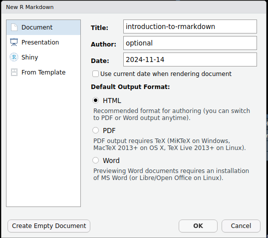
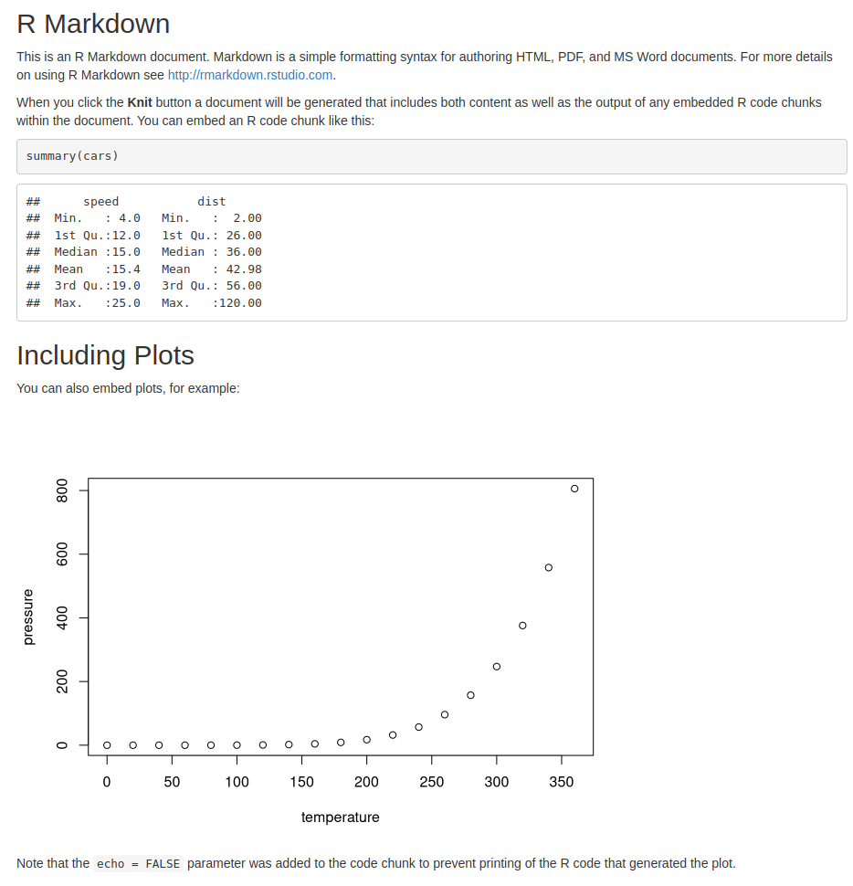

# Reproducibility and Report with R Markdown

**Reproducibility** is one of the core values in data science and R makes it both achievable and easy! Imagine trying to recreate someone’s analysis only to find that you get different results or that they left out crucial steps. Frustrating, right? Reproducibility is the answer—it means you can get the same results every time by following the same steps.

**Why Reproducibility Matters**

- **Trustworthiness:** When your results can be replicated, others can trust your analysis.
- **Error Detection:** Re-running the same code helps catch mistakes early.
- **Efficiency:** With reproducible scripts, you save time if you need to redo parts of your analysis.

## Key Tools in R for Reproducibility and Reporting

Let's dive into the tools that make reproducibility and reporting a breeze in R:

1. **R Markdown:** This is the gold standard for reproducible reports in R. You can write code, comments, and format it all beautifully in one document. Think of it as combining your code with a notebook-style narrative.

  - **Interactive Demo:** Create an R Markdown file in RStudio by clicking File > New File > R Markdown…. You can add headers, code chunks, and text.
  - **Run Your Code:** Run each chunk individually, or click Knit to create a fully formatted report with all your code and outputs embedded.

2. **Setting a Seed for Consistency:** R’s random number generator can be controlled with `set.seed()`. For instance;
```{r}
set.seed(42)
sample(1:100, 5)
```

This will always produce the same random sample, making your analysis consistent. 

3. **Code Commenting and Documentation:** Clear comments make your analysis easy to understand for others and for yourself. Use comments (`#`) in your code to describe steps, and include documentation for more complex functions.

Below is an example of a comment.
```{r}
# This is a comment
```

## Creating Reproducible Reports

Let’s walk through a simple activity where we create a reproducible report:

1. **Set Up Your R Markdown File**

- Open RStudio and create a new R Markdown file.
- Add a title, your name, and the date.
- Start with an introduction: Below is an example of a report to introduce R makrdown.



- Insert the relevant details and press **Ok** to create a markdown file. An introductory report explaining how markdown works will be automatically generated. For more information about R makrdown visit [here](https://rmarkdown.rstudio.com/articles_intro.html)

2. **Add Your Code and Analysis**

Insert code chunks for each analysis step. For example, try loading and summarizing the `mtcars` data set:
```{r}
# Load the data 
data(mtcars)

# Summary of the data set
summary(mtcars)
```

3. **Customize and Style Your Report**

- Add section headers, bold text, and bullet points to organize your report.
- You can use `ggplot2` to add visualizations for a polished look.
```{r}
library(ggplot2)
ggplot(mtcars, aes(x = hp, y = mpg)) +
  geom_point() +
  labs(title = "Horsepower vs. Miles per Gallon")
```

4. **Knit the Report**

- Click the **Knit** button to render your report into an HTML, PDF, or Word document.
- Notice how your code, output, and comments are all integrated.

Here is how the report should look like when knitted. 



## Going Beyond: Shiny for Interactive Reporting

For advanced projects, consider using Shiny to create interactive reports! Shiny apps can run right in your browser and allow users to interact with your data in real time.

<span style="color: brown;">*More details on RShiny will be discussed later on the next topic*</span>

Reproducibility is a powerful skill—keep practicing, and you’ll quickly see how it enhances your data work!

<span style="color: green;">**Hands-on Exercises**</span>

Create an R Markdown file with:

i. A title and introduction explaining your analysis.
ii. An example dataset analysis (try using `iris` or `mtcars`).
iii. A basic visualization.
iv. A conclusion summarizing your findings.
v. Knit the report to html

_______________________________________________________________________
<span style="color: brown;">**Solution**</span> 


<span style="color: brown;">**________________________________________________________________________________**</span>