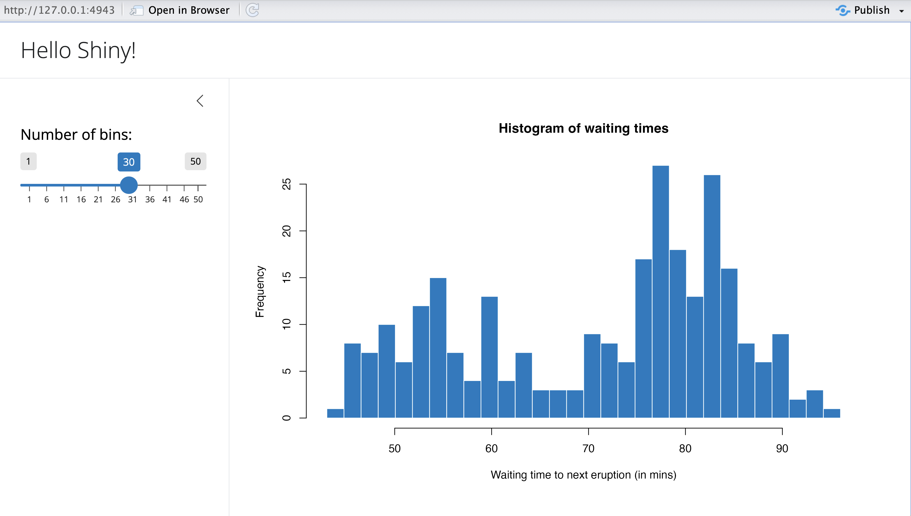
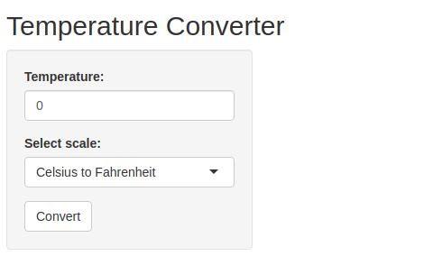
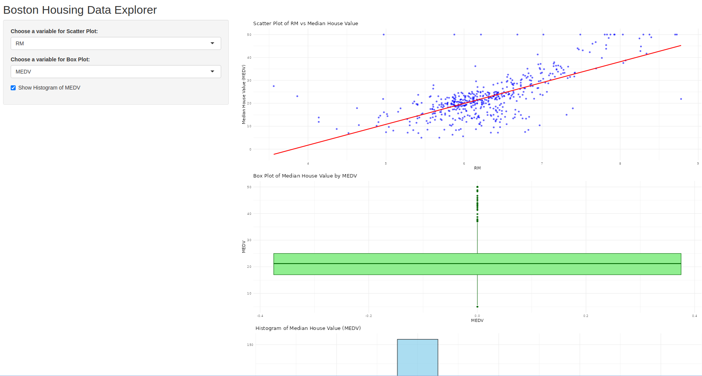

# R Shiny
Shiny is a fantastic R package that allows you to easily create interactive web applications (or "apps") directly from R. In this lesson, we’ll dive right into how to start building Shiny apps.

First things first, if you haven’t installed the Shiny package yet, simply open R, make sure you’re connected to the internet, and run the following command:
```
install.packages("shiny")
```
Shiny also integrates with another package called `bslib`, which helps in creating visually appealing user interfaces (UIs). To explore more about it, you can check out its documentation [here](https://rstudio.github.io/bslib/index.html?_gl=1*zs9lrr*_ga*MTE1OTUxODYwNi4xNzI0OTMzNDk1*_ga_8QJS108GF1*MTcyOTE0NzUzMi4yLjEuMTcyOTE0ODQ0MC4wLjAuMA..*_ga_2C0WZ1JHG0*MTcyOTE0NzUzMi43LjEuMTcyOTE0ODQ0MC4wLjAuMA..).

Here is an example of an R shiny app 


The Shiny package comes with several pre-built examples that showcase how Shiny works in action. Each example is a fully functional Shiny app.

The Hello Shiny example, for instance, generates a histogram using R’s *faithful* data set. The histogram’s bin count can be adjusted by the user through a slider, and the app instantly updates based on their selection. This example is perfect for learning the basics of Shiny app structure and building your very first app.

To try it out, just run the following commands in R:
```
library(shiny)
runExample("01_hello")
```

## Structure of a Shiny App
Shiny apps are typically organized in a single script called `app.R`, which resides in a designated folder (for example, `newdir/`). You can run the app by executing `runApp("newdir")`.

The `app.R` file consists of three main components:

1. A User Interface Object
2. A Server Function
3. A Call to the shinyApp Function

### User Interface(ui)
The user interface (ui) object defines the layout and visual aspects of your app. Below is the `ui` object used in the Hello Shiny example:
```{r}
library(shiny)
library(bslib)

# Define UI for app that draws a histogram ----
ui <- page_sidebar(
  # App title ----
  title = "Hello Shiny!",
  # Sidebar panel for inputs ----
  sidebar = sidebar(
    # Input: Slider for the number of bins ----
    sliderInput(
      inputId = "bins",
      label = "Number of bins:",
      min = 1,
      max = 50,
      value = 30
    )
  ),
  # Output: Histogram ----
  plotOutput(outputId = "distPlot")
)
```

### Server
Here is the server function for the Hello Shiny Example:
```{r}
# Define server logic required to draw a histogram ----
server <- function(input, output) {

  # Histogram of the Old Faithful Geyser Data ----
  # with requested number of bins
  # This expression that generates a histogram is wrapped in a call
  # to renderPlot to indicate that:
  #
  # 1. It is "reactive" and should automatically
  #    re-execute when inputs (input$bins) change
  # 2. Its output type is a plot
  output$distPlot <- renderPlot({
  
    x    <- faithful$waiting
    bins <- seq(min(x), max(x), length.out = input$bins + 1)

    hist(x, breaks = bins, col = "#007bc2", border = "white",
         xlab = "Waiting time to next eruption (in mins)",
         main = "Histogram of waiting times")
  })

}
```

At its core, the server function in the Hello Shiny example is quite straightforward. It performs some calculations and generates a histogram based on the specified number of bins.

However, you’ll notice that most of the script is wrapped in a call to `renderPlot`. The comment above the function provides some explanation, but don't worry if it seems unclear; we will explore this concept in greater detail later.

Before you start experimenting with the Hello Shiny app and reviewing its source code, remember that your `app.R` file should begin with loading the Shiny package and conclude with a call to `shinyApp`:
```
library(shiny)

# See above for the definitions of ui and server
ui <- ...

server <- ...

shinyApp(ui = ui, server = server)
```
While the Hello Shiny app is running, your R session will be occupied and won't accept other commands. R is actively monitoring the app and processing its reactions. To regain access to your R session, press the escape key or click the stop icon located in the upper right corner of the RStudio console panel.

How that you have known how to create an RShiny app, lets create a simple temperature converter that will convert temperature from Celcius to Farenheit. 

```{r results='hide'}
library(shiny)

# Define UI for the Temperature Converter app
ui <- fluidPage(
  titlePanel("Temperature Converter"),
  
  sidebarLayout(
    sidebarPanel(
      numericInput("temp_input", "Temperature:", value = 0),
      selectInput("temp_scale", "Select scale:", 
                  choices = c("Celsius to Fahrenheit", "Fahrenheit to Celsius")),
      actionButton("convert", "Convert")
    ),
    
    mainPanel(
      textOutput("result")
    )
  )
)

# Define server logic for the Temperature Converter
server <- function(input, output) {
  observeEvent(input$convert, {
    if (input$temp_scale == "Celsius to Fahrenheit") {
      result <- (input$temp_input * 9/5) + 32
      output$result <- renderText({ 
        paste(input$temp_input, "°C =", round(result, 2), "°F")
      })
    } else {
      result <- (input$temp_input - 32) * 5/9
      output$result <- renderText({ 
        paste(input$temp_input, "°F =", round(result, 2), "°C")
      })
    }
  })
}

# Run the app
shinyApp(ui = ui, server = server)
```

Create a folder called `"shiny_app_demo"` and create an R script file called `app.R` where you will write the above code.

After importing `shiny` and `bslib` libraries in your current environment run the app by executing the code below
```
library(shiny)
runApp("shiny_app_demo")
```

This is how the app is expected to show up. 


**Note: ** Everything will stop until you close the app


<span style="color: orange;">**Try it!**</span>

We will create a shiny app based on the `mtcars` built-in data set. This app lets you visualize the mpg agains any other variable in the data set. Follow the steps below;

i. Create a directory called `"shiny_apps"`. Inside the `shiny_app` directory, create another directory called `app_01`. 
ii. In the `app_01` directory, create an R script file called `app.R`. Add the lines below to import the necessary libraries 
```
library(shiny)
```
iii. Create a UI component by adding the lines below
```
# UI Component
ui <- fluidPage(
  titlePanel("Scatter Plot Visualizer"),
  sidebarLayout(
    sidebarPanel(
      selectInput("variable", "Choose Variable for x-axis:", 
                  choices = names(mtcars), selected = "hp")
    ),
    mainPanel(
      plotOutput("scatterPlot")
    )
  )
)

```
iv. Now add the lines below to create a server component
```
# Server Component
server <- function(input, output) {
  output$scatterPlot <- renderPlot({
    plot(mtcars[[input$variable]], mtcars$mpg,
         xlab = input$variable, ylab = "mpg",
         main = paste("mpg vs", input$variable))
  })
}
```
v. Finally, run the app  by adding the line below towards the end of the script
```
# Run the App
shinyApp(ui = ui, server = server)
```
vi. Run the below script in a different environment and watch the app in action!
```
library(shiny)
runApp("shiny_apps/app_01")
```

<span style="color: orange;">**Try it again!**</span>

How about we make a bar chart using the built-in iris data set? Yes, we will have the bar chart that allows us to filter different iris species and visualize each characteristics separately. Lets get into action! Follow the steps below. 

i. Create a director `app_02` and add a new R script file called `app.R`. 
ii. Add the code below to `app.R` to import the necessary library
```
library(shiny)
library(ggplot2)
```
iii. Add the ui components with the `sidePanel`(where the control takes place) and the `mainPanel` (Where the chart shows up). Add the lines of code below. 
```
# UI Component
ui <- fluidPage(
  titlePanel("Bar Chart Explorer"),
  sidebarLayout(
    sidebarPanel(
      checkboxGroupInput("species", "Select Species:", 
                         choices = unique(iris$Species), 
                         selected = unique(iris$Species))
    ),
    mainPanel(
      plotOutput("barChart")
    )
  )
)
```
iv. Add the server component where the calculations will take place. Use the `renderPlot` to show the app that you need to plot.
```
# Server Component
server <- function(input, output) {
  output$barChart <- renderPlot({
    filtered_data <- iris[iris$Species %in% input$species, ]
    ggplot(filtered_data, aes(Species)) +
      geom_bar(fill = "steelblue") +
      labs(title = "Species Count", x = "Species", y = "Count")
  })
}
```
v. Add the lines below to complete the script
```
# Run the App
shinyApp(ui = ui, server = server)
```
vi. Finally, run the code below in a different environment to get the app running. 
```
library(shiny)
runApp("shiny_apps/app_02")
```

## <span style="color: green;">**Hands-On Exercise**</span>

In this exercise, you will be required to download the Boston housing data set from [here]( https://www.kaggle.com/datasets/fedesoriano/the-boston-houseprice-data). Follow the instructions below to create a shiny app. 

i. Load the data set
ii. Your shiny app should have a simple structure with; 
  
  - A sidebar panel for inputs 
  - A main panel to display visualizations 

iii. Implement the following functionalities in your app;

  - A scatter plot that will allow the user to select an independent variable from the data set(e.g crime rate, number of rooms) to plot against the median house value (`MEDV`). 
  - Provide an option for the user to view a histogram of the median house value to understand  the distribution of the housing prices. 
  - Allow the user to select the categorical variable like `CHAS` to compare distributions of `MEDV` using a boxplot. 
  
iv. Make sure you use labels and titles for each title to make visualizations easy to understand. Also, comment your code to explain what each part does. 

Here are the app layout requirements;

1. Side bar panel

  * A dropdown menu for selecting an independent variable (e.g., `CRIM`, `RM`, `TAX`) for the scatter plot.
  * A checkbox to view the histogram of `MEDV`.
  * A dropdown menu for selecting the categorical variable (`CHAS`) for the box plot.
  
2. Main Panel

  * A scatter plot that shows the relationship between the selected variable and `MEDV`.
  * A histogram of `MEDV` when selected.
  * A box plot of `MEDV` grouped by `CHAS`.
  

Remember to do your work in a folder `assignment` that will be inside the `shiny_apps` directory. Create an `app.R` script. 

_______________________________________________________________________
<span style="color: brown;">**Solution**</span> 

Check the `app.R` file in `shiny_apps/assignment/` directory. 

This is how the app is created and run; 

- Create a directory `assignment` in the `shiny_apps`. 
- Within the `assignment` directory create an R script `app.R`.
- Add the code below to install and import the necessary libraries. 
```
# Install the library 
install.packages("shiny")

# Load necessary libraries
library(shiny)
library(ggplot2) # for plotting
```
- Thereafter, add the lines to below to the `app.R` file to create a UI component. 
```
# Define UI for the app
ui <- fluidPage(
  titlePanel("Boston Housing Data Explorer"),
  
  sidebarLayout(
    sidebarPanel(
      selectInput("xvar", "Choose a variable for Scatter Plot:",
                  choices = names(boston_df)[-14], # Excluding 'medv' as it's the dependent variable
                  selected = "RM"),  # Default selection
      selectInput("box_var", "Choose a variable for Box Plot:",
                  choices = names(boston_df), selected = "MEDV"),
      checkboxInput("show_hist", "Show Histogram of MEDV", FALSE)
    ),
    
    mainPanel(
      plotOutput("scatterPlot"),
      plotOutput("boxPlot"),
      plotOutput("histPlot")
    )
  )
)
```
- Now that the UI is ready, add the lines below to create the server logic for the app. 
```
# Define server logic for the app
server <- function(input, output) {
  
  # Scatter Plot: Selected variable vs Median House Value (medv)
  output$scatterPlot <- renderPlot({
    ggplot(boston_df, aes_string(x = input$xvar, y = "MEDV")) +
      geom_point(color = "blue", alpha = 0.6) +
      geom_smooth(method = "lm", col = "red", se = FALSE) +
      labs(title = paste("Scatter Plot of", input$xvar, "vs Median House Value"),
           x = input$xvar, y = "Median House Value (MEDV)") +
      theme_minimal()
  })
  
  # Box Plot of MEDV by Categorical Variable
  output$boxPlot <- renderPlot({
    ggplot(boston_df, aes_string(y = input$box_var)) +
      geom_boxplot(fill = "lightgreen", color = "darkgreen") +
      labs(title = paste("Box Plot of Median House Value by", input$box_var),
           x = input$box_var) +
      theme_minimal()
  })
  
  # Histogram of MEDV
  output$histPlot <- renderPlot({
    if (input$show_hist) {
      ggplot(boston_df, aes(x = MEDV)) +
        geom_histogram(binwidth = 5, fill = "skyblue", color = "black", alpha = 0.7) +
        labs(title = "Histogram of Median House Value (MEDV)",
             x = "Median House Value", y = "Frequency") +
        theme_minimal()
    }
  })
}
```
- The UI and server is ready. Finally, we need to add the lines below to enable the app to run.
```
# Run the app
shinyApp(ui = ui, server = server)
```
- Save the file and run the below line to the console to get the app running. 
```
library(shiny)
runApp("shiny_apps/assignment/app.R")
```

Here is how the app will look like


<span style="color: brown;">**________________________________________________________________________________**</span>