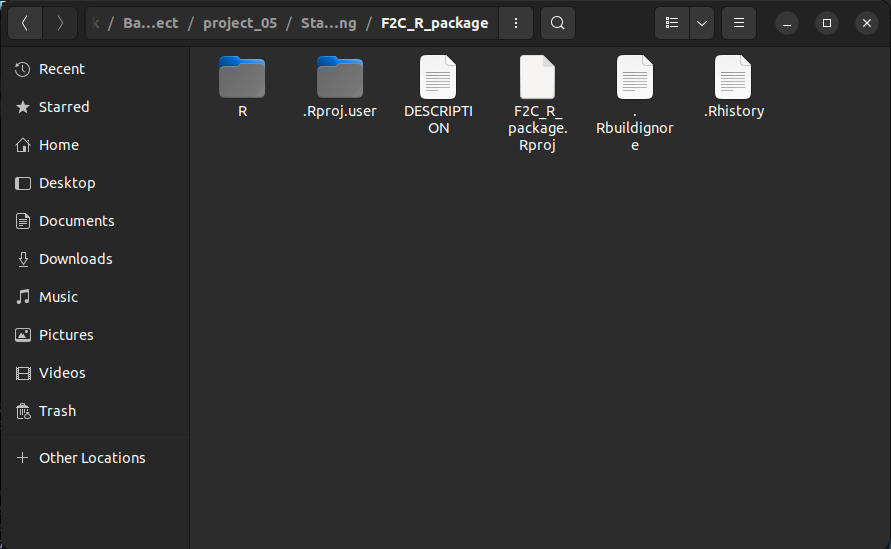

# Building R Packages

## Introduction 

In the second chapter we introduced about functions and we later talked about package functions, here we will now focus on how to build those packages. Packages are bundles of code and data to perform created by R users or community to perform a set of goven tasks. 

In this course you have encountered several packages like `dplyr`, `plyr` and `ggplot2` and might have installed one or many of them. Packages provide a ready-to-use functions and data sets that produce results faster without the need to write everything from scratch. Here we will discuss how you can create you own package in R. This will give you a deeper appreciation of the packages you rely on daily basis and how they are built. 

CRAN(The Comprehensive R Archive Network) and GitHub provide a repository where one can host and install packages to their local environments. 

In this guide, we will walk through how to create a package and host the packages either on GitHub.

## Prerequisites 

Before we jump in, there are a few packages you will want to have ready to help us along the way. We will install `devtools` and `roxygen2`. 

Install the packages
```
# Install devtools 
install.packages("devtools")

# Install roxygen
install.packages("roxygen2")
```

It might be necessary to restart R studio after installing the above packages 

## Building a simple R package

Here is where the fun begin! We will create a simple R package to serve you with the basics of building packages. The package will involve two functions; 

i. A function to convert temperature from degrees Fahrenheit($^oF$) to degrees Celsius($^oC$). 
ii. A function to convert temperature from degrees Celsius($^oC$) to degrees Fahrenheit($^oF$).

**Step 1**

Create a folder that will hold the whole R package, in our case we will name the folder `F2C_R_package` like the one below.
                                                                


**Step 2**

Currently this folder is empty, lets create another folder inside this `F2C_R_package` folder and name it `R`.


Here is where all the R scripts are stored. It can hold any amount of R files and each R file can hold any amount of R functions. You could example give each function each own file or insert more than function in a file. 

For large projects it is recommended to group similar functions in the same R file. 

**Step 3**

In our new R package, we will write both the two functions discussed above in the same file called, `temp_conversion.R` that has the code below;
```{r}
# Convert from Fahrenheit to Celsius
F_to_C <- function(F_temp){
  C_temp <- (F_temp -32) * 5/9
  return (C_temp)
}

# Convert from Celsius to Fahrenheit
C_to_F <- function(C_temp){
  F_temp <- (C_temp * 9/5) + 32
  return(F_temp)
}
```

That is the whole file for now, it has less than 15 lines of code. 


**Step 4** 

Next, create a file called `DESCRIPTION` in the `F2C_R_package` directory. This will be a plain text file with no extension and it will hold some of the metadata on the R package. In our case, it will hold the following lines of code specifying the package name, type, title and the version number. 
```
Package: F2CTempConverter
Type: Package
Title: Temperature Conversion Package for Demonstration
Version: 0.0.1.0
```

This is now a working R package and can be loaded by;
```{r warning=FALSE}
library(devtools);

load_all("F2C_R_package") # Load the directory path to where the package is

# Lets convert the temperature from Fahrenheit to Celsius
F_to_C(79)

# Converting from Celsius to Fahrenheit
C_to_F(20)
```

After this its good to add documentation to help users know what the function does. 

## Making A New R Project 

What we just did was an overview of how a package is created. Lets now explore how you can create a complete package with documentation. 

To do this go to `File > New Project ...` and the dialog box below should pop up. 


We will choose the `Existing Directory` option then `browse` to the `F2C_R_package` and click `Create Project` to create project from an existing directory. Now you should be able to see the project inside the package directory. 



## Adding Documentation 

Documentation helps others use the package that we have built, furthermore we can refer to the documentation to refer what we did after a long time. Documentation shows up in the `Help` tab of R Studio when running the function `help`. Just run the following in R studio to understand what I meant.
```
help(lm)
```

`?` does the same thing as `help`

```
?lm
```

You see there a tab that pops up with a documentation on `Linear Models`


The `roxygen2` package is used to make these helpful markdown files. We will then add some explanations to the code file, `temp_conversion.R`. Update the code to look the one below. 
```
#' Fahrenheit conversion
#'
#' Convert degrees Fahrenheit temperatures to degrees Celsius
#' @param F_temp The temperature in degrees Fahrenheit
#' @return The temperature in degrees Celsius
#' @examples 
#' temp1 <- F_to_C(50);
#' temp2 <- F_to_C( c(50, 63, 23) );
#' @export
F_to_C <- function(F_temp){
    C_temp <- (F_temp - 32) * 5/9;
    return(C_temp);
}

#' Celsius conversion
#'
#' Convert degrees Celsius temperatures to degrees Fahrenheit
#' @param C_temp The temperature in degrees Celsius
#' @return The temperature in degrees Fahrenheit
#' @examples 
#' temp1 <- C_to_F(22);
#' temp2 <- C_to_F( c(-2, 12, 23) );
#' @export
C_to_F <- function(C_temp){
    F_temp <- (C_temp * 9/5) + 32;
    return(F_temp);
}
```

The size of the code has increased but we now have helpful reminders to use each function. Lets go through each line type and explain;

- `#' Fahrenheit conversion` and `#' Celsius conversion` are the function titles. 
- `@param F_temp` and `@param C_temp` are the function parameters or arguments .
- `' @return ...` is used to indicate the return value of the function.
- `#' @examples ...` is shows an example use case of the function. 

The format explained above is called the Roxygen format and there are more tags recognized by the `roxygen2` package. For more information visit [Karl Broman's page](http://kbroman.org/pkg_primer/pages/docs.html). This format makes it easy to create files in markdown for documentation. 

Now that we have the documentation ready, lets open the project as guided earlier and run the following in the console. 
```
library(roxygen2); # Read in the roxygen2 R package
roxygenise();      # Builds the help files
```

and here is how our package will look like. 


"man" and a plain text `NAMESPACE` have been added. The `man` directory holds the written help files while the `NAMESPACE` works with R to integrate them into the package correctly. The `NAMESPACE` file should not be edited by hand. Here are the contents of the namespace file.
```
# Generated by roxygen2: do not edit by hand

export(C_to_F)
export(F_to_C)
```

Inside the `man` directory there are two markdown files for the `C_to_F` and `F_to_C` functions. Feel free to load the package
```
library(devtools);
load_all("F2C_R_package")
```

as earlier and ask for help with `F_to_C`.
```
?F_to_C
```

The below will be presented in the 'Help' tab of R Studio.


## Uploading and Installing from Github 

Now that we have package read and working we can upload to github for sharing and version control. Follow the steps below to get your package hosted and ready for sharing. 

**Step 1: Create a github repo**

1. Visit [github](https://github.com) and sign in(or sign up if you don't have an account)
2. Click the **New** button to create a new repository. 
3. Name the repository ideally the same as the package name. In our case we will name our repository `F2C_R_package`. Add a description and make the repository public so that anyone can access it. Don't initialize a README file since you will pushing your files from R Studio. 
4. Finally click **Create repository**. 

**Step 2: Set up Git in R Studio**

1. Open your package project in R Studio. 
2. Go to `Tools > Project Options > Git/SVN` and select `Git` to enable version control. 
3. To commit you package to GitHub, first make sure you have git installed locally then link your R Studio project to your GitHub repository using the following commands in the terminal. 

```
# Intialize git in the project 
git init 

# Add all the files 
git add . 

# Commit files with a message
git commit -m "First upload of F2C_R_package" 

# Add your github repository as the remote 
git remote add origin https://github.com/your-username/F2C_R_package.git

# Push your commit to github
git push -u origin main
```

Replace `your-username` with your actual Github username. This will push the package files to GitHub. 

**Step 3: Install your Package from Github on Any Machine**

Now, that your package is ready on Github, you can use the `devtools` package in R:

1. Open an R session.
2. Install devtools if you haven't already(we installed it earlier)
```
install.packages("devtools")
```
3. Use `devtools::install_github` to install the packge from Github.
```
devtools::install_github("your-username/F2C_R_package")
```

Remember to replace `"your-username"` with you actual github details. R will download and install the package from GitHub. You can now load it via
```
library(F2C_R_package)
```

**Additional Tips** 

- remember to update your repo whenever you make changes to the package. 
- Add a README file for documentation on how the file works and how to install it. 

*You package is now on GitHub and ready for installation and use!*

## <span style="color: green;">**Hands-on Exercises**</span> 

Create a package called weight converter that converts mass from Kilograms(kg) to Pounds(lb) and vice versa.

- Tag it as version `0.0.1` in the `DESCRIPTION` file.
- Add necessary documentations 
- Upload it to Github
- Add README file to show how to install and use the file 
- Install on your local machine from GitHub using `devtools` library. 
- Finally, test your newly installed package and run some code.

_______________________________________________________________________
<span style="color: brown;">**Solution**</span> 

Instruction to; 

- Test the functionalities (Function to convert Kilos to pounds and back)
- Check documentation
- Check version tagged in the `DESCRIPTION` file. 
- Check if package pushed to github(optional)

Complete Solution in `K2P_R_package` directory

Here is how the package is created; 

- Install the packages required to build the app.
```
# Install devtools 
install.packages("devtools")

# Install roxygen
install.packages("roxygen2")
```
- Create a folder and name it `K2P_R_package`. 
- In the `K2P_R_package` directory, create a directory called `R`. 
- In the `R` directory, created an R script file called `mass_converter.R`. 
- Add the lines below to the `mass_converter.R` to create a function `K_to_P` that converts mass from Kilo to Pounds. 
```
K_to_P <- function(K_mass){
  P_mass <- (K_mass * 2.20462)
  return (P_mass)
}
```
- Add the lines below to the `mass_converter.R` to create a function `P_to_K` that converts mass from Pounds to Kilos. 
```
P_to_K <- function(P_mass){
  K_mass <- (P_mass/2.20462)
  return (K_mass)
}
```
- Under the `K2P_R_package` directory, add a file named `DESCRIPTION` and add the following lines;
```
Package: K2PMassConverter
Type: Package
Title: Convert mass from kilo to pounds and vice versa
Version: 0.0.1
RoxygenNote: 7.3.2
```
- This is now a working file and can be add loaded to the R workspace by;
```
library(devtools);
load_all("K2P_R_package") # Load the directory path to where the package is
```
- Test the functionalities of the package by trying to convert mass from Kilos to Pounds and back. 
```
K_to_P(53) # Convert from Kilos to Pounds
P_to_K(156) # COnvert from Pounds to Kilos
```
- The package can be uploaded to github or CRAN for collaboration. In this case, upload to github but first open it as a project. You will click `File>New Project>Existing Directory` then select the `K2P_R_package` folder. 
- Add a documentation to the package by adding these lines above the `K_to_P` function.
```
#' Kilogram conversion
#'
#' Convert mass in Kilogram to Pounds
#' @param K_mass The mass in Kilograms
#' @return The mass in Pounds
#' @examples 
#' mass1 <- K_to_P(69);
#' mass2 <- K_to_P( c(55, 69, 71) );
#' @export
```
- Add these lines above the `P_to_K` function
```
#' Pounds conversion
#'
#' Convert mass in Pounds to Kilograms
#' @param P_mass The mass in Pounds
#' @return The mass in Kilograms
#' @examples 
#' mass1 <- P_to_K(150);
#' mass2 <- P_to_K( c(200, 155, 342) );
#' @export
```
- The whole `mass_converter.R` script will look like this 
```
#' Kilogram conversion
#'
#' Convert mass in Kilogram to Pounds
#' @param K_mass The mass in Kilograms
#' @return The mass in Pounds
#' @examples 
#' mass1 <- K_to_P(69);
#' mass2 <- K_to_P( c(55, 69, 71) );
#' @export
K_to_P <- function(K_mass){
  P_mass <- (K_mass * 2.20462)
  return (P_mass)
}

#' Pounds conversion
#'
#' Convert mass in Pounds to Kilograms
#' @param P_mass The mass in Pounds
#' @return The mass in Kilograms
#' @examples 
#' mass1 <- P_to_K(150);
#' mass2 <- P_to_K( c(200, 155, 342) );
#' @export
P_to_K <- function(P_mass){
  K_mass <- (P_mass/2.20462)
  return (K_mass)
}
```
To the console while the project is still open run the lines below to package the help file and the whole package 
```
library(roxygen2); # Read in the roxygen2 R package
roxygenise();      # Builds the help files
```
- Visit github and create a new repo, finally commit your work. 
- To find the documentation to specific functions on the `K2P_R_package` run
```
?K_to_P
```
- Try that to the `P_to_K` function. 


<span style="color: brown;">**________________________________________________________________________________**</span>